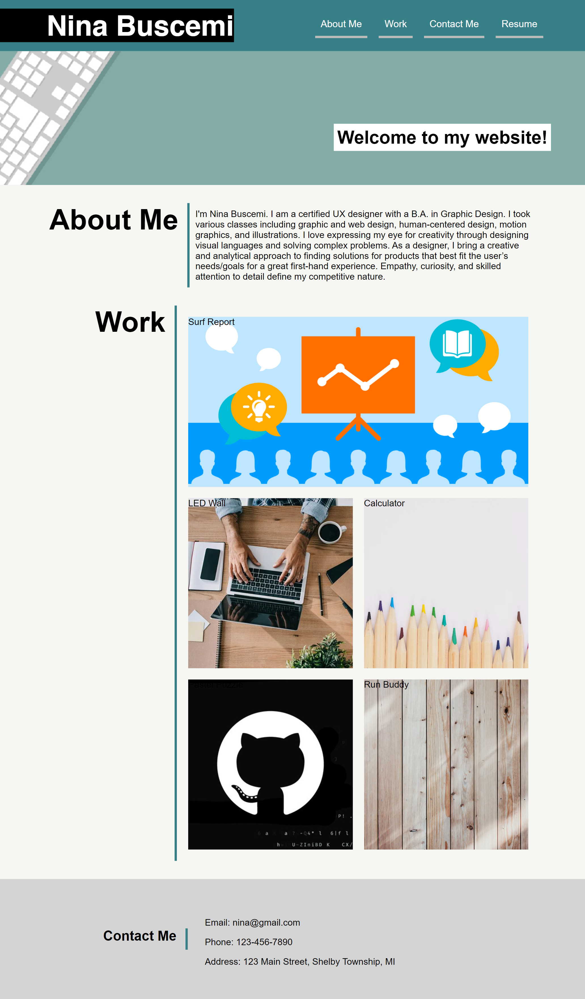

# portfolio-module-2

A web application built from scratch displaying work that showcases my skills and talents.

##Table of Contents
- [Installation](#installation)
- [Usage](#usage)
- [Deployment URL](#url)
- [License](#license)
- [Tests](#tests)
- [Questions](#questions)

## Installation

1. Clone the repository.
2. Install dependencies with `npm install`.
3. Run the application with `npm start`.

## Usage

1. Open the application in your browser.
2. Explore the different features and functionalities.
3. Use the contact information to ask questions.

## Deployment URL

https://ninabuscemi.github.io/portfolio-module-2/

## License

This project is not licensed.

## Questions

If you have any questions, please contact me at [ngbuscemi@gamil.com(mailto:ngbuscemi@gmail.com)]
