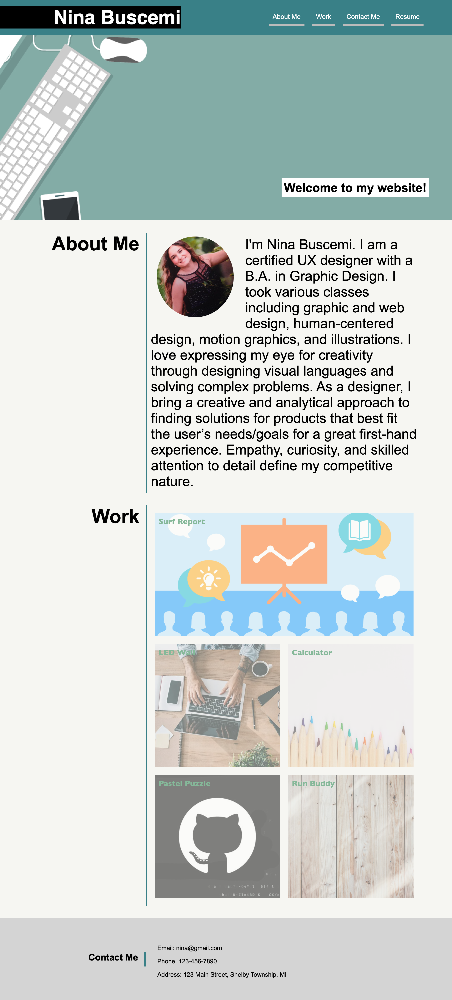

# 02 Responsive Portfolio

A web application built from scratch displaying work that showcases my skills and talents.

## Description

Welcome to the Work Day Scheduler! This application allows you to easily plan and organize your work day by saving events for each hour of a typical working day (9am to 5pm). With a user-friendly interface and dynamic updates, you can stay on top of your schedule and never miss an important task.

## User Story

AS AN employer
I WANT to view a potential employee's deployed portfolio of work samples
SO THAT I can review samples of their work and assess whether they're a good candidate for an open position

## Acceptance Criteria

GIVEN I need to sample a potential employee's previous work
WHEN I load their portfolio
THEN I am presented with the developer's name, a recent photo or avatar, and links to sections about them, their work, and how to contact them
WHEN I click one of the links in the navigation
THEN the UI scrolls to the corresponding section
WHEN I click on the link to the section about their work
THEN the UI scrolls to a section with titled images of the developer's applications
WHEN I am presented with the developer's first application
THEN that application's image should be larger in size than the others
WHEN I click on the images of the applications
THEN I am taken to that deployed application
WHEN I resize the page or view the site on various screens and devices
THEN I am presented with a responsive layout that adapts to my viewport

## Mockup

## Installation

To open the Responsive Portfolio, follow these steps:

1. Clone the repository to your local machine.
2. Open the index.html file in your preferred web browser.

## Contributing

Contributions to the Responsive Portfolio are welcome! If you find any issues or have suggestions for improvements, please submit a pull request. Make sure to follow the repository's code style and guidelines.